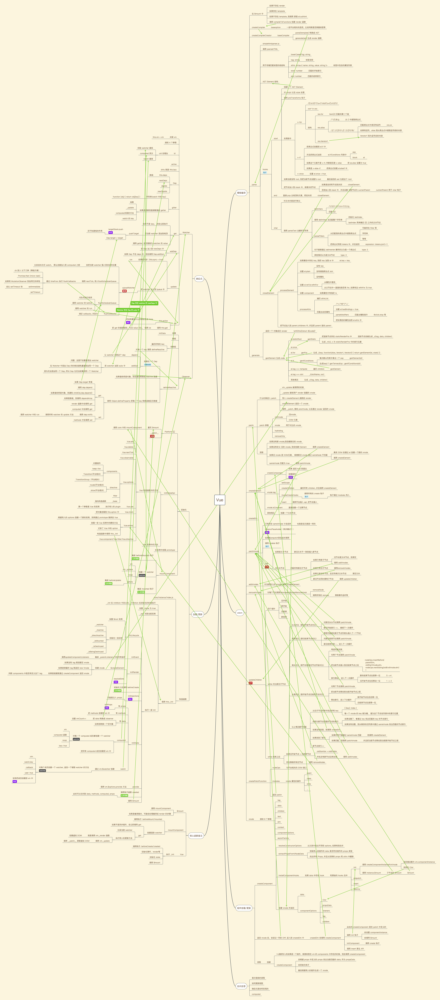

# 3-2 简答题

## 1. 请简述 Vue 首次渲染的过程。

1. 【实例化】Vue 实例化后，会触发 init，做一系列初始化的事情，比如初始化事件（发布订阅），初始化 data，把 data 转换成响应式对象，期间触发 beforeCreate, 以及 created 钩子。
2. 【mount】当 Vue 实例如果传入了 el, 则会进行挂载操作， 调用实例上的 \$mount 方法
3. 【编译】\$mount 由平台相关的代码定义，如果是带编译版本的 Vue, 会判断是否有 render 函数，如果没有则判断是否有 template 或者直接读取 outhtml, 然后将 template 转换成 render 函数
4. 【创建 watcher】\$mount 会调用 mountComponent, 此时会调用钩子 beforeMount, 之后创建一个 Watcher, 之后调用 mounted 钩子
5. 【watcher 执行 get】Watcher 接受第二个参数作为 getter, 这个 getter 在 Watcher 实例化之后，如果是 sync watcher， 则会立即被调用， Watcher 中会调用 render， render 传递一个 createElement 作为参数， 之后后返回一个 vnode
6. 【render】render 在创建的时候接受一个参数 h, h 第一个参数如果是字符串则创建一个普通的 vnode, 否则则会认为是一个组件， 通过调用 createComponent 创建组件的 vnode
7. 【createComponent 创建 vnode】createComponent 会把参数作为 vnode 的 componentOptions 中保留， 并且通过 data 确认组件的 props，最后再返回组件的 vnode 用于 patch
8. 【patch】在 Watcher 中，render 返回 vnode 后，会传递给 update,并且调用 \_\_patch\_\_ 进行新旧 vnode 对比，如果旧节点是一个真实的 vnode， 则会根据旧节点创建一个空的 vnode, 接着调用 createElm。
9. 【createComponent】 会去假设这个 vnode 是一个组件，并且尝试创建，如果 vnode 是组件则会调用 vm 中对应的 init 钩子，并且调用 vm 的$mount， 继续进入 $mount 流程, 否则继续流程
10. 【createElm】根据 vnode 的情况创建元素节点，如果有 tag, 则认为是元素，调用 createElement 创建 element 节点，并且插入到 el 之前
11. 节点插入之后则会删除 oldElm

## 2. 请简述 Vue 响应式原理。

1. Vue 会把传入的 data 转换成 Observer 对象，下面说一下 Observer
2. Observer 接收的对象可能是数组，或纯对象
   1. 纯对象情况
      1. 如果是纯对象， 则遍历这个对象，通过 Object.defineProperty 拦截对成员的遍历
      2. 并且为每一个成员创建一个 Dep， 每个成员在被读取的时候会收集当前的 watcher
      3. 【注释】watcher 分为三种
         1. render watcher, Dep 收集到这个 watcher 后，调用 notify 会更新当前组件
         2. computed watcher, vm 在读取 computed 时从计算当前的 computed, 并且里面有访问 vm 的 data 成员的话，会被 data 成员对应的 Dep 收集，当成员修改后会重新调用 computed 计算新的值
         3. user watcher, 为每一个 user watcher 定义一个 watcher, getter 则是组成一个读取成员的方法， 当读取 vm 中的成员之后会收集到 user watcer, 当成员修改后，会重新执行 user watcher 的回调函数
      4. watcher 中记录了处理函数， 比如 render watcher 的处理过程就是调用 vm 的 render 生成 vnode, 再调用 update 的 \_\_patch\_\_ 对新旧 vnode 进行 diff 或直接挂载
      5. 当成员修改之后，会通知所有收集到的 watcher, 调用对应的 update 来重新执行处理函数 getter
   2. 数组情况
      1. 数组情况在 data 的二级成员以后，当 observer 遇到数组成员后，会将数组成员中带副作用的方法进行重写， 并且将所有子元素都转换成 observer 对象
      2. 当调用重写的方法后，如果有新增的成员，会将新增的成员也转换 observer, 并且调用对应 Dep 的 notify 通知更新
      3. 数组的 Dep 是在成员访问的时候进行 watcher 收集的，data 成员通过递归下级成员，获取到 childObj, childObj 其中就可能是数组 Dep
   3. 如果非数组或非纯对象，则会跳过不进行 observer 转换

## 3. 请简述虚拟 DOM 中 Key 的作用和好处。

1. 作用： diff 算法中用于确定两个 vnode 是否相同，除了 key 用于判断是否相同外，还有 vnode 的 tag, 是否注释节点，是否定义 data 等
2. 好处： 快速定位可能是相同的 vnode, 如果没有 key, 则需要对剩余的每一个 vnode 进行 sameVnode 找出相同的 vnode 的索引, 之后再进行 sameVnode, 而有 key 的情况只需要根据 key 找出对应的索引，再进行 sameVnode

## 4. 请简述 Vue 中模板编译的过程。

模板编译会根据传入的 template 通过 parse 转换成 AST, 再将 AST 转换成 对应的 render 函数

1. parse 过程
   1. 循环 template, 匹配开始、结束、文本等节点，匹配成功收，substr template, 继续循环匹配，知道结束
   2. 当匹配到开始节点后，会创建一个 ASTElement, 并且处理对应的指令， 如果是子闭合节点，则会 closeElement, 否则则会加入栈中 比如：
      1. v-for 会匹配出 for 表达式，以及 alias、iterator1、iterator2 等放在 ASTElement 中
      2. v-if 会匹配出 if 表达式
      3. 等等
   3. 当匹配结束节点，则会直接调用 closeElement
   4. 当匹配文本节点， 如果文本节点有 \{\{\}\} 则会设置节点的 type: 2, 并且记录 expression
   5. closeElement 会从栈中读取中最后的节点，并且处理节点的动态属性： v-/@/:/. 等，并且将当前节点加入到 parent 的 children 中
2. generator 过程
   1. 生成一段 with 的语句，
   2. code 根据特定的标识生成，静态节点会将他保存到 staticRenderFns 中用于保存， 普通节点会生成 \_c(tag, xxx) 代码， 以及一些特定节点会特殊处理，如
   3. el.for 生成 \_l(exp, function(alias, iterator1, iterator2) { return xxx })
   4. el.if 生成 exp ? xxx : xxx
   5. slot 生成 \_t(slotname) 等
3. 最后再调用 createFunction 通过 new Function 创建成 render 函数

## 源码脑图

