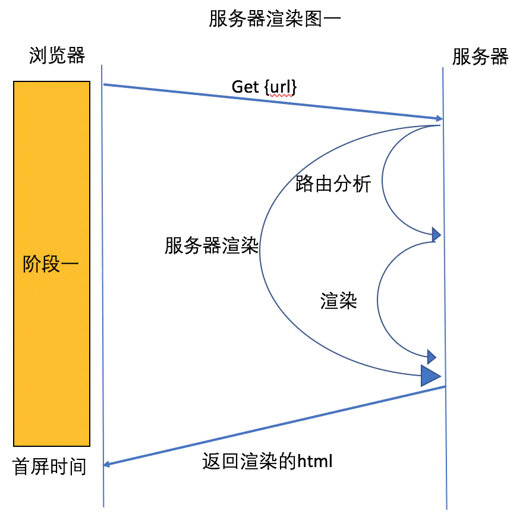

# 笔记

## Vuex 状态管理

### 组件的传值方式

1. 父子组件传值: props
2. 子父组件传值: props + 回调
3. 不相干组件传值: eventbus

### Vuex 核心概念

#### Vuex 与全局对象的区别

1. vuex 中的状态是响应式的，修改 vuex 状态会更新对应的组件
2. vuex 的状态只能通过 mutation 进行修改， 方便状态跟踪

> 我们通过提交 mutation 的方式，而非直接改变 store.state.count，是因为我们想要更明确地追踪到状态的变化。这个简单的约定能够让你的意图更加明显，这样你在阅读代码的时候能更容易地解读应用内部的状态改变。此外，这样也让我们有机会去实现一些能记录每次状态改变，保存状态快照的调试工具。有了它，我们甚至可以实现如时间穿梭般的调试体验。

#### State

State 包含了全部的应用级别的状态，每个应用只包含一个 store, 单一数据源原则 SSOT, 单一状态树能够快捷点定义任意一个状态判断，能够更轻松的获取整个应用的状态快照

Store 的状态是响应式的，通过 store 注入到每一个 Vue 的组件实例中

mapState 辅助函数能够自动生成计算属性，减少重复代码

严格属于某个组件的状态，依然放在组件的局部状态中

#### Getter

getter 和计算属性一样，他会根据依赖项缓存求值，当依赖项改变后会重新求值

#### Mutation

Mutation 是整个 Store 唯一能修改状态的地方，并且对应的处理方法必须是同步的，这样 devtool 才能跟踪到状态的变化前后。

### Action

Action 类似 Mutation, 但是 Action 不能直接修改 state, 只能通过 commit 提交给 Mutation 进行修改， Action 中可以是异步的操作

### 简单实现 Vuex

```javascript
export default class SampleVuex {
  static install(Vue) {
    _Vue = Vue
    Vue.mixin({
      beforeCreate() {
        if (this.$parent) {
          this.$store = this.$parent.$store
          return
        }
        this.$store = this.$options.store
      },
    })
  }

  static Store = class Store {
    constructor(options) {
      console.dir(_Vue)
      this.state = _Vue.observable(options.state || {})

      this.mutations = options.mutations || {}

      this.actions = options.actions || {}

      this.getters = new Proxy(options.getters || {}, {
        get(context, key) {
          const handler = Reflect.get(context, key)
          if (typeof handler !== 'function') {
            return handler
          }
          return handler(this.state)
        },
        set() {
          throw new Error('getter cannot set')
        },
      })
    }

    dispatch(type, payload) {
      this.actions[type](this, payload)
    }

    commit(type, payload) {
      this.mutations[type](this.state, payload)
    }
  }
}
```

## SSR 基础

### 服务端渲染基础



### 服务端渲染优势

1. 利于 SEO
2. 首屏显示效率更快

### 服务端渲染的问题

1. 前后端代码完全耦合在一起，不利于开发维护
2. 前端没有足够的开发空间
3. 服务端压力大
4. 用户体验一般

## Nuxt 基础

Nuxt 是一套基于 Vue 的通用框架，支持支持客户端渲染，与同构渲染。以下是它的特点：

1. 基于 Vue.js
2. 自动代码分层
3. 服务端渲染
4. 强大的路由功能，支持异步数据
5. 静态文件服务
6. ES6+ 支持
7. 打包压缩
8. 头部标签管理
9. 热更新
10. 支持 HTTP/2 等

Nuxt 基于目录约定的形式为为代码分层。

1. assets 资源目录
2. components 组件
3. layouts 布局组件
4. middleware 中间件
5. pages 页面，每一个目录代表一个路由
6. plugins 插件
7. static 静态资源目录
8. store Vuex 目录等

### Nuxt 路由

Nuxt 的路由默认从 pages 底下获取，pages 下每一个目录会被生成一条路由规则，也可以在 nuxt.config.js 中通过 router.extendRoutes 手动处理路由

### Nuxt AsyncData

异步数据在页面组件渲染前执行，他会在服务端或者路由更新前被调用，由于 asyncData 能在服务端调用，所以它不能根据 this 访问到 vue 实例，它的第一个参数 context 可以获取到当前请求的一些参数。
最终返回的值会与通过 data 设置的数据融合。

### Nuxt 上下文

asyncData 中的上下文对象包含了整个请求的所有状态，包括请求行、请求头、响应行、响应头等

### 异常处理

通常有两种方式处理异常情况：

1. 使用 Nuxt 默认的异常页面
   1. 通过 nuxt 上下文中的 error 函数将错误信息抛给异常页面
   2. 通过 AsyncData 的第二个参数 callback 将异常情况抛给异常页面
1. 手动 catch 接管异常处理

### 登陆流程

1. 首次登陆后，将 token 设置到 cookie 中并且保存在 store 中，之后客户端每次请求都获取 token 带上
2. 再次打开页面后，由于 token 设置在 cookie 中，所以服务端渲染的时候可以根据请求头中带上的 cookie 设置登陆状态
   1. 通过 store 的 nuxtServerInit store 在服务端的初始化逻辑
   2. 通过 req 获取到请求头上的 cookie
   3. 将 cookie 解析并且通过 commit 提交到 store 中

### 请求处理

由于每次请求都需要带上用户的 Token， 获取请求前需要提前获取到，由于 cookie/storage 等都是客户端的 API 不适用服务端渲染的情况，所以需要从两端都支持的 store 中获取 token  
可以通过 nuxt 提供的 plugins 读取到 store， 在利用 axios 的拦截器设置 store 中的 token

#### 并发请求

并发请求可以使用 Promise.all 或者 Promise.allSellet 实现

### 自动部署

利用 Github Action

```yaml
name: Deploy To Vercel

on:
  push:
    branches:
      - master

jobs:
  deploy:
    runs-on: ubuntu-latest

    steps:
      - name: Checkout 🤞
        uses: actions/checkout@v2

      - name: Setup node 🤟
        uses: actions/setup-node@v1
        with:
          node-version: 12.x

      - name: Build Project 👌
        run: npm install && npm run build

      - name: Deploy 🤏
        run: npx vercel --token=${{ secrets.ACCESS_TOKEN }} --confirm  --prod
```
