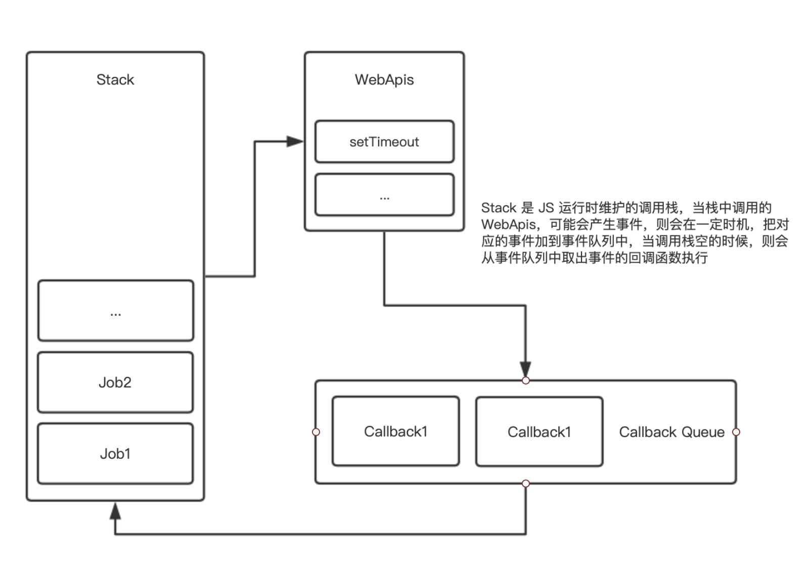
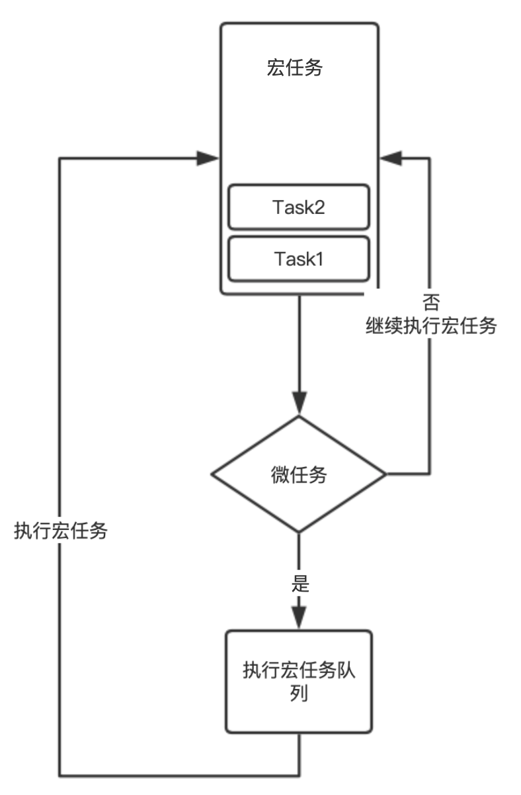

## 简答题

### 第一题：

- 结果：打印出 10
- 原因：通过 var 声明的变量不会产生块级作用域，在执行 a[6]() 时，此时的 i 已经变成了 10， 所以打印 10

### 第二题：

- 结果：抛出异常
- 原因：{}（大括号）会生成块级作用域，在 `if` 中通过 `let` 声明的 `tmp` 会在当前块级作用域中形成一个“暂时性死区”，所以此时无法在声明前访问 `tmp`

### 第三题：

- 结果：Math.min(...arr)
- 原因: 通过 `Math.min` 可以求出一组数据中的最小值，利用 ES6 的解构(...)， 将数组中的每一个元素作为参数传入给 `Math.min`

### 第四题：

- `var`: 是 `ECMAScript 2015` 前用来声明变量的方式，这种声明方式有：“变量提升”、“可重复声明” 等特点
- `let`: 是 `ECMAScript 2015` 之后出现的声明变量的方式，声明的变量是：“可变的”，“不可重复声明”，“只作用于当前作用域” 等特点
- `const`: 与 `let` 同时期出现的方式，与其类似，区别是：“`const` 声明的变量是不可变的”，这种不可变对于“引用类型”的变量来说，是指它的引用地址不变，但是它的属性依然可以修改

### 第五题：

- 结果： 打印 20
- 原因： 方法 obj.fn() 被调用的时候， `fn` 方法的 `this` 值被指向为 `obj`, `fn` 中调用 `setTimeout` 传入的是一个箭头函数，根据箭头函数的执行上下文（this）是由声明时所处的执行上下文决定的，所以在箭头函数中的 `this` 也指向为 `obj`, 故而打印 20

### 第六题：

- 作为内部的一些钩子，比如实现 `Symbol.iterator` 的对象能够被迭代器 `for of` 迭代
- 作为私有属性、内部变量
- 避免键冲突，如 redux 的 action type

### 第七题：

- 浅拷贝： 对于基础类型，拷贝数据的值，对于属性值是引用类型，则拷贝数据的引用地址
- 深拷贝： 基础类型与浅拷贝一致，对于属性值是引用类型，则拷贝引用类型中的成员属性，

> 深拷贝需要避免循环引用问题，解决方法之一有：通过 set 保存所有已经拷贝过的对象，在新拷贝一个属性值为对象的时候判断是否存在 `set` 中，从而避免重复拷贝陷入死循环

### 第八题：

**异步编程**:

一个调用发起时，在获得结果前无法发起其他调用，称为同步模式，反之，一个调用发起时，不能立即获得结果，需要借助其他措施，且期间能够线程中发起其他调用，称为异步模式。

`Javascript` 诞生，是为了处理浏览器中网页的交互，为了避免同时处理 DOM、UI 等交互带来的复杂性，Javascript 被设计成单线程的语言。  
单线程意味着在同一时间只有一个任务被执行，当遇到耗时任务时，线程就会被阻塞，JS 利用异步模式避免这种阻塞，其中包含 API 如 Promise, setTimeout 等

**Event Loop**:

事件驱动主要是依赖事件循环完成的，程序开始时就进入了主循环，主循环不停的从事件队列中读取事件，如果有关联的回调，则会执行。  
在 `JS 代码` 被执行的时候，会产生调用栈，栈中的代码调用各种 `API`, 有些会产生事件被加到事件队列中，当调用栈中没有运行的执行上下文且调用栈为空的时候，主循环将会从事件队列中读取事件，依次执行这些事件的回调函数。当事件队列执行完之后，会进入下一个循环



**宏任务**:

调用栈中中执行的任务都是宏任务

**微任务**:

微任务是由宏任务创建的，它的执行时机是当没有运行的宏任务且宏任务队列为空的时候再依次执行微任务队列。



### 第九题:

```typescript
const setTimeoutPromise = (value, timeout) => {
  return new Promise((resolve) => {
    setTimeout(() => resolve(value), timeout);
  });
};

setTimeoutPromise([], 10)
  .then(() => {
    const a = "hello ";
    return setTimeoutPromise([a], 10);
  })
  .then((res) => {
    const b = "lagou ";
    return setTimeoutPromise([...res, b], 10);
  })
  .then((res) => {
    const c = "I ❤ U";
    console.log([...res, c].reduce((a, b) => a + b));
  });
```

### 第十题

Tyepscript 是 Javascript 的超集，在 Javascript 的基础上新增了：`类型系统`, `ES6+ 的支持`

### 第十一题

**优点**
1. 新增类型系统，增强代码的健壮性，减少运行时的错误
2. 支持 ES6+ 特性
3. 增强代码的智能提示，方便重构
4. 在编译阶段就能发现错误

**缺点**
1. `Javascript` 是动态类型语言，能难完全的覆盖所有参数的签名
2. `Any` 相当于弱类型，并且缺少 Flow 的 mixed，相当于依然可以采用弱类型的方式编写代码
3. 第三方库并不是所有都集成 Typescript, 需要手动 mock
