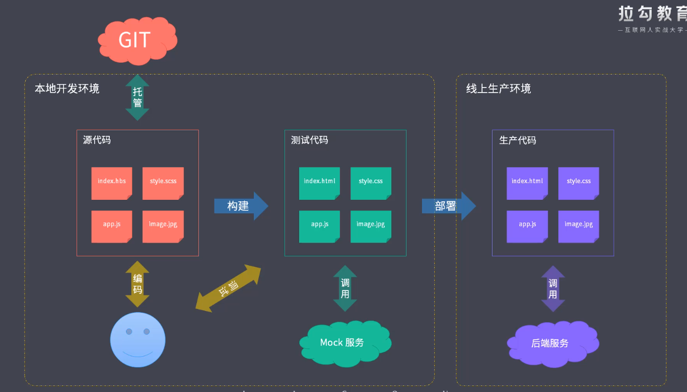

## 第一节

### 工程化

#### 解决问题:

- 解决传统语法的弊端
    - 使用 ES6+ 语法
    - 提升 CSS 的编程性
- 解决无法直接使用模块化和组件化
    - 使用模块化,组件化提升模块的可维护性
- 解决重复劳动
    - 部署上线前的工作
    - 部署步骤流程化,持续化
- 统一代码风格,提高质量
- 解决需要依赖后端接口
    - mock 数据, 接口
- 解决整体依赖后端项目
    - 打包代码嵌入后端项目中

#### 工程化表现

- 创建阶段
    - 利用脚手架创建特定且统一的项目结构
    - 生成特定的文件
- 编码阶段
    - 统一的代码风格
    - 统一的编译\构建\打包
- 测试\预览阶段
    - webServer/Mock 减少后端依赖
    - LiveReload/HMR 热更新
    - SourceMap 
- 提交阶段
    - git hooks
    - Lint-Staged
- 部署阶段
    - CI/CD
    - 自动发布

#### 工具在工程化中的作用

工具只是用来落地工程化的一种手段

**工程化步骤**
    - 文件的组织结构
    - 源代码的开发范式
    - 如何做前后端分离(ajax, 中间层)
    ...

提前做好整体规划,在选择相应的工具来做对应的落地

**集成化工程方案**
- 目录结构
- 热更新
- 自动编译
- 校验等等

**node**

前端的工业革命,前端工程化由 node 推动

- 脚手架开发
- 自动构建打包系统
- 模块化打包
- 项目代码规范
- 自动化部署

